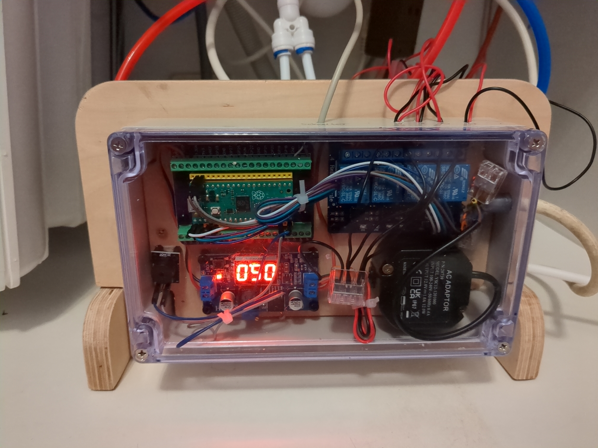

# Reverse Osmosis Filtration System Control for Raspberry Pi Pico

## Program Summary

This script is designed for a Raspberry Pi Pico running [MicroPython](https://micropython.org/) 
(yet should be compatible with other platforms running MicroPython), 
with the goal of controlling a set of 4 valves for a reverse osmosis filtration system. 
The system is controlled with one button and offers the following main features:

- Automatic flushing of the osmosis membrane every few hours to prevent germ development in the filters.
- Automatic disposal of the first filtered water (which contains more particles due to the lowered pressure in the osmosis membrane during idle time).
- Setting a fixed time interval for water filtration to yield a specific amount of water, which can be stored via a long button press.

The script is structured to be asynchronous, allowing it to handle multiple operations efficiently without blocking the main execution flow.

My final system looked like shown in the following two images:

## Layout

Here is the layout of all electrical components and their wiring.
Note that the jumper has been removed from the relay effectively separating the coils from the Pico control circuit
and preventing any loop backs that would disturb the Pico itself.

## Schema

Here is the overview of how the valves are employed in the filtration process.

## Hardware parts

For the full system, I used the following hardware parts:

- Raspberry Pi Pico (or other platform running MicroPython)
- 4 valves for controlling water flow - I employed [1/4" Puro XD-12 water valves](https://www.amazon.de/gp/product/B07WFZYXN4/) by Puro Water.
- Relais module for controlling the valves - I used the [4 channel DC 5V relais module](https://www.amazon.de/gp/product/B01M8G4Y7Z) by ELEGOO.
- Button for user interaction - I employed a [simple button](https://www.amazon.de/gp/product/B001BAUDN2/).
- Buzzer for audio feedback - I employed the [KY-006 Passiver Piezo-Buzzer](https://sensorkit.joy-it.net/de/sensors/ky-006) from the SensorKit X40 by Joy It.
- 12V power supply - I used the [YSC 12-120100 12](https://www.conrad.de/de/p/2618042.html) from Dehner.
- DC-DC Step-down converter module to provide the correct voltage for the Raspberry Pi Pico (taking it from the 12V power supply) - I employed the [LM2596S DC-DC Buck Converter Step Down Modul](https://www.amazon.de/gp/product/B07VWHRW34) by Innovateking.
- (Optionally) A Raspberry Pi Pico Breakout Board for better mounting - I used the [Breakout Board](https://www.amazon.de/gp/product/B0BMZVRQBR) by DUBEUYEW.
- A suitable case - I employed the waterproofed [IP35 case by edi-tronic](https://www.amazon.de/gp/product/B0747N4X58) along with a thin wooden plate on which I could mount the modules to with screws.
- A set of screws for the different modules - I used a set of [HSeaMall nylon screws](https://www.amazon.de/gp/product/B07CJGT93C/).
- A reverse osmosis system such as the [Aquamichel Mini](https://www.lebendiges-trinkwasser.shop/shop/aquamichel-mini-teileset/).
- 1/4" tubes and connectors.

## Configuration

The script uses a configuration file (`config.json`) for various timing operations. 
You can modify these settings in the configuration file to adapt the system to your specific requirements. 
The file is created if it does not exist. It is persistently stored on the SD card of the Raspberry Pi Pico.

The file contains the following parameters:

- `flush_sec`: Time in seconds for the flush operation.
- `disposal_sec`: Time in seconds for the disposal operation.
- `filter_sec`: Time in seconds for the filter operation.
- `auto_flush_sec`: Time in seconds for automatic flushing (default: 8 hours).
- `water_clean_sec`: Time in seconds for water cleaning operation.

## Usage

To use the script:

1. Ensure you have a Raspberry Pi Pico connected to the necessary hardware components (valves, button, buzzer).
2. Upload the script to your Raspberry Pi Pico running MicroPython.
3. Optionally: Adapt the `config.json` file with your desired timing settings.
4. The system will perform automatic flushing, water disposal, and filtration based on your configuration.

## Button Controls

- Short press: Initiates water filtration for the configured duration.
- Long press: Initiates a long water filtration process (of 1 hour max.).
- During filtration:
    - Short press: Stops the filtration process.
    - Long press: Saves the fitration time as new filtration interval to the configuration file.

## License

This project is licensed under the GNU Public License v3 - see the [LICENSE](LICENSE) file for details.
